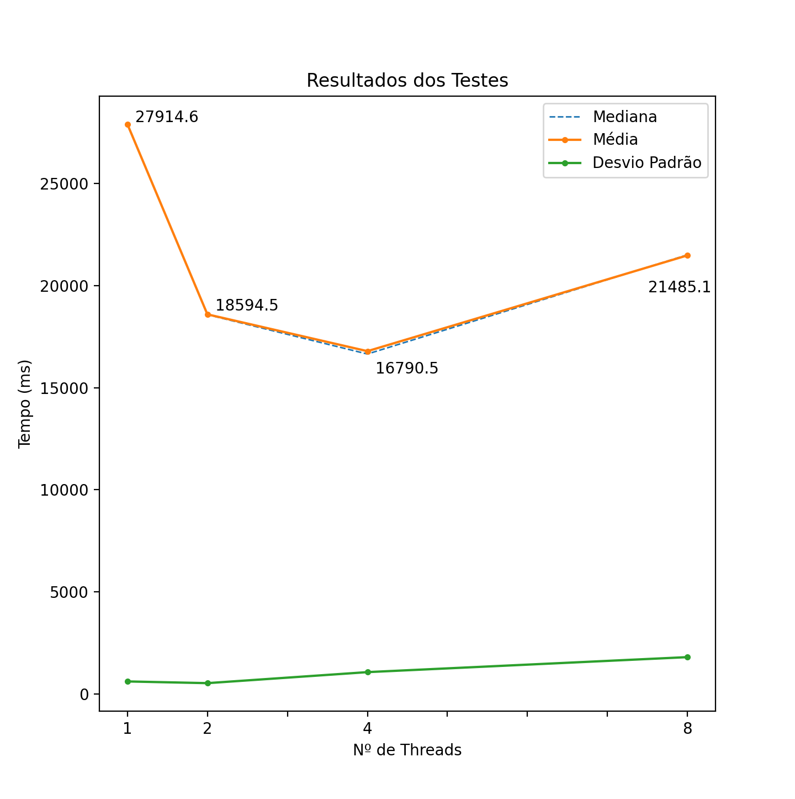

# Distributed Systems Class projects

## Resultados dos testes

O script foi executado 10 vezes em um computador com processador ARM 8-core (Appple M1) e os resultados podem ser observados abaixo:

| Nº de Threads |    1    |    2    |    4     |    8     |
| ------------- | ------- | ------- | -------- | -------- |
|     Média     | 27914.6 | 18594.5 | 16790.5  | 21485.1  |
|    Mediana    | 27930.5 | 18580.5 | 16650.5  | 21512.0  |
|  Desv. Padrão | 604.973 | 521.438 | 1061.389 | 1796.656 |

  

