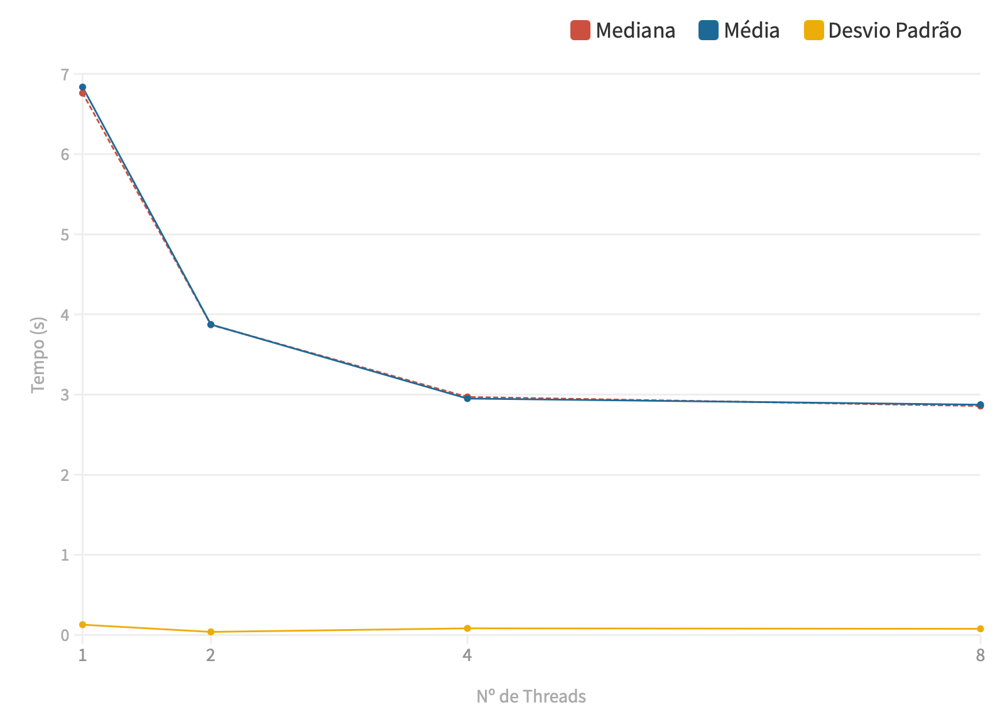
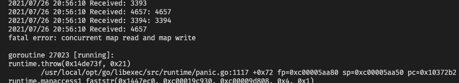

# Middleware gRPC

### Instruções de Execução

Para rodar o servidor, entre na pasta ```go-server``` e execute os comandos ```make``` e ```make run```.

Para rodar o cliente, entre na pasta ```python-client```, instale as bibliotecas necessárias através do comando ```pip install -r requirements.txt``` e execute o cliente através do comando ```python3 client.py```. É importante configurar no código, antes de sua execução, o número de inteiros e de processos a serem utilizados.


### Resultados dos testes

O script foi executado 10 vezes em um computador com processador ARM 8-core (Apple M1) e os resultados podem ser observados abaixo:

| Nº de Threads |    1    |    2    |    4    |    8    |
| ------------- | ------- | ------- | ------- | ------- |
|     Média     | 6.83620 | 3.87353 | 2.95023 | 2.87331 |
|    Mediana    | 6.76131 | 3.87214 | 2.97024 | 2.85702 |
|  Desv. Padrão | 0.12837 | 0.03846 | 0.08285 | 0.07714 |

<p align="left">
  
</p>

### Concorrência nos requests

Conforme notamos, o GRPC abstrai, no servidor, a forma como lida com as requisições, executando o máximo que consegue e enfileirando as demais.

Ao tentar executar o script pela primeira vez, no entanto, nos deparamos com o seguinte erro no servidor (em Go Language):

<p align="left">
  
</p>

De acordo com nossas pesquisas, isso se dá pelo fato de que a linguagem não permitia a leitura/escrita da hashtable de forma simultânea. Desas forma, foi necessário implementar um Mutex de leitura e escrita, que pode encontrado no arquivo ```safe_hashtable.go```.

Em Python, o principal desafio foi lidar com as diferenças entre Threads e Processos e suas relações com funções Async. Como resultado, optamos por utilizar Processos (```multiprocessing Process```) e funções síncronas da biblioteca GRPC.
